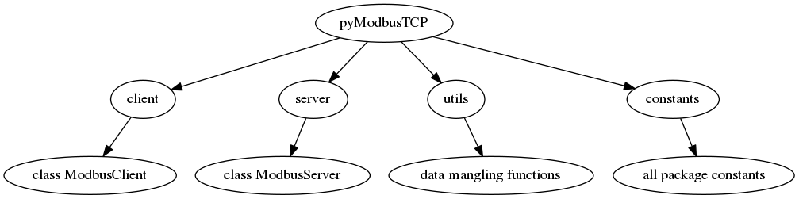

Quick start guide
=================

Overview of the package
-----------------------

pyModbusTCP give access to modbus/TCP server through the ModbusClient object. 
This class is define in the client module.

To deal with frequent need of modbus data mangling (for example 32 bits IEEE 
float to 2x16 bits words convertion) a special module named utils provide some 
helful functions.

**Package map:**

Package setup
-------------

from PyPi::

    # for Python 2.7
    sudo pip-2.7 install pyModbusTCP
    # or for Python 3.2
    sudo pip-3.2 install pyModbusTCP
    # or upgrade from an older release
    sudo pip-3.2 install pyModbusTCP --upgrade

from Github::

    git clone https://github.com/sourceperl/pyModbusTCP.git
    cd pyModbusTCP
    # here change "python" by your python target(s) version(s) (like python3.2)
    sudo python setup.py install

ModbusClient: init
------------------

init module from constructor (raise ValueError if host/port error)::

    from pyModbusTCP.client import ModbusClient
    try:
        c = ModbusClient(host="localhost", port=502)
    except ValueError:
        print("Error with host or port params")

you can also init module from functions host/port return None if error::

    from pyModbusTCP.client import ModbusClient
    c = ModbusClient()
    if not c.host("localhost"):
        print("host error")
    if not c.port(502):
        print("port error")

ModbusClient: manage TCP link
-----------------------------

After init ModbusClient, you need to open the TCP link. After this, you can 
call a modbus request function (see list in next section)::

    if c.open():
        regs_list_1 = c.read_holding_registers(0, 10)
        regs_list_2 = c.read_holding_registers(55, 10)
        c.close()

With a forever polling loop, TCP always open (auto-reconnect code)::

    while True:
        if c.is_open():
            regs_list_1 = c.read_holding_registers(0, 10)
            regs_list_2 = c.read_holding_registers(55, 10)
        else:
            c.open()
        time.sleep(1)

ModbusClient: available modbus requests functions
-------------------------------------------------

See http://en.wikipedia.org/wiki/Modbus for full table.

+------------+------------------------------+---------------+---------------------------------------------------------------------+
| Domain     | Function name                | Function code | ModbusClient function                                               |
+============+==============================+===============+=====================================================================+
| Bit        | Read Discrete Inputs         | 2             | :py:meth:`~pyModbusTCP.client.ModbusClient.read_discrete_inputs`    |
|            +------------------------------+---------------+---------------------------------------------------------------------+
|            | Read Coils                   | 1             | :py:meth:`~pyModbusTCP.client.ModbusClient.read_coils`              |
|            +------------------------------+---------------+---------------------------------------------------------------------+
|            | Write Single Coil            | 5             | :py:meth:`~pyModbusTCP.client.ModbusClient.write_single_coil`       |
|            +------------------------------+---------------+---------------------------------------------------------------------+
|            | Write Multiple Coils         | 15            | n/a                                                                 |
+------------+------------------------------+---------------+---------------------------------------------------------------------+
| Register   | Read Input Registers         | 4             | :py:meth:`~pyModbusTCP.client.ModbusClient.read_input_registers`    |
|            +------------------------------+---------------+---------------------------------------------------------------------+
|            | Read Holding Registers       | 3             | :py:meth:`~pyModbusTCP.client.ModbusClient.read_holding_registers`  |
|            +------------------------------+---------------+---------------------------------------------------------------------+
|            | Write Single Register        | 6             | :py:meth:`~pyModbusTCP.client.ModbusClient.write_single_register`   |
|            +------------------------------+---------------+---------------------------------------------------------------------+
|            | Write Multiple Registers     | 16            | :py:meth:`~pyModbusTCP.client.ModbusClient.write_multiple_registers`|
|            +------------------------------+---------------+---------------------------------------------------------------------+
|            | Read/Write Multiple Registers| 23            | n/a                                                                 |
|            +------------------------------+---------------+---------------------------------------------------------------------+
|            | Mask Write Register          | 22            | n/a                                                                 |
+------------+------------------------------+---------------+---------------------------------------------------------------------+
| File       | Read FIFO Queue              | 24            | n/a                                                                 |
|            +------------------------------+---------------+---------------------------------------------------------------------+
|            | Read File Record             | 20            | n/a                                                                 |
|            +------------------------------+---------------+---------------------------------------------------------------------+
|            | Write File Record            | 21            | n/a                                                                 |
|            +------------------------------+---------------+---------------------------------------------------------------------+
|            | Read Exception Status        | 7             | n/a                                                                 |
+------------+------------------------------+---------------+---------------------------------------------------------------------+
| Diagnostic | Diagnostic                   | 8             | n/a                                                                 |
|            +------------------------------+---------------+---------------------------------------------------------------------+
|            | Get Com Event Counter        | 11            | n/a                                                                 |
|            +------------------------------+---------------+---------------------------------------------------------------------+
|            | Get Com Event Log            | 12            | n/a                                                                 |
|            +------------------------------+---------------+---------------------------------------------------------------------+
|            | Report Slave ID              | 17            | n/a                                                                 |
|            +------------------------------+---------------+---------------------------------------------------------------------+
|            | Read Device Identification   | 43            | n/a                                                                 |
+------------+------------------------------+---------------+---------------------------------------------------------------------+

ModbusClient: debug mode
------------------------

If need, you can enable a debug mode for ModbusClient like this::

    from pyModbusTCP.client import ModbusClient
    c = ModbusClient(host="localhost", port=502, debug=True)

or::

    c.debug(True)

when debug is enable all debug message is print on console and you can see 
modbus frame::

    c.read_holding_registers(0, 4)

print::

    Tx
    [E7 53 00 00 00 06 01] 03 00 00 00 04
    Rx
    [E7 53 00 00 00 0B 01] 03 08 00 00 00 6F 00 00 00 00
    [0, 111, 0, 0]

utils module: Modbus data mangling
----------------------------------

Sample data mangling, usefull for interface PLC device.

- 16 bits to 32 bits integers::

    from pyModbusTCP import utils
    list_16_bits = [0x0123, 0x4567, 0x89ab, 0xcdef]

    # big endian sample (default)
    list_32_bits = utils.word_list_to_long(list_16_bits)
    # display "['0x1234567', '0x89abcdef']"
    print([hex(i) for i in list_32_bits])

    # little endian sample
    list_32_bits = utils.word_list_to_long(list_16_bits, big_endian=False)
    # display "['0x45670123', '0xcdef89ab']"
    print([hex(i) for i in list_32_bits])

- two's complement (see http://en.wikipedia.org/wiki/Two%27s_complement)::

    from pyModbusTCP import utils
    list_16_bits = [0x0000, 0xFFFF, 0x00FF, 0x8001]

    # display "[0, -1, 255, -32767]"
    print(utils.get_list_2comp(list_16_bits, 16))

    # display "-1"
    print(utils.get_2comp(list_16_bits[1], 16))

- an integer of val_size bits (default is 16) to an array of boolean::

    from pyModbusTCP import utils
    # display "[True, False, True, False, False, False, False, False]"
    print(utils.get_bits_from_int(0x05, val_size=8))

- gateway between IEEE single precision float and python float::

    from pyModbusTCP import utils

    # convert python float 0.3 to 0x3e99999a (32 bits IEEE representation)
    # display "0x3e99999a"
    print(hex(utils.encode_ieee(0.3)))

    # convert python float 0.3 to 0x3e99999a (32 bits IEEE representation)
    # display "0.300000011921" (it's not 0.3, precision leak with float...)
    print(utils.decode_ieee(0x3e99999a))

